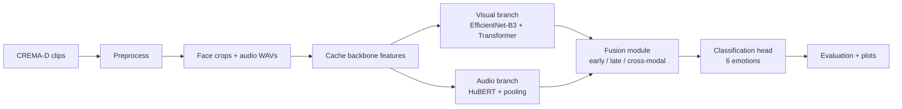
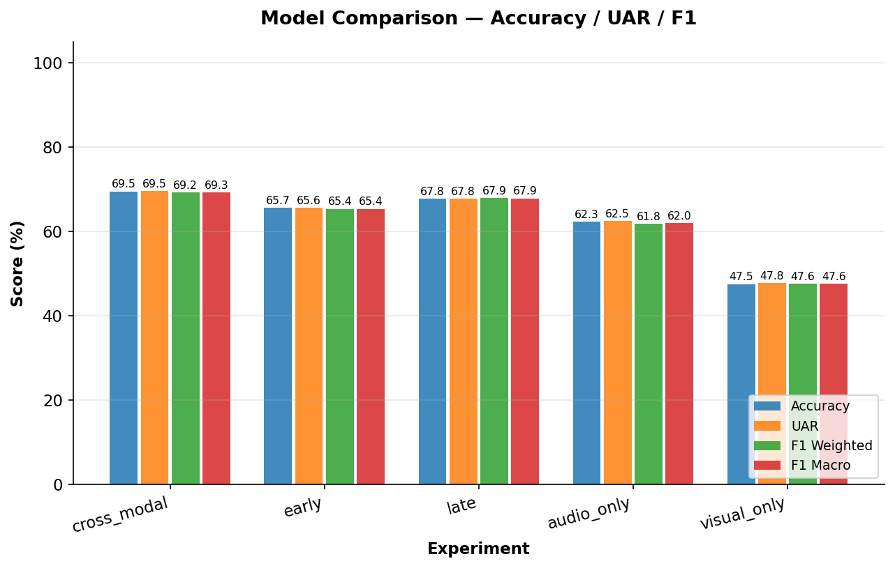
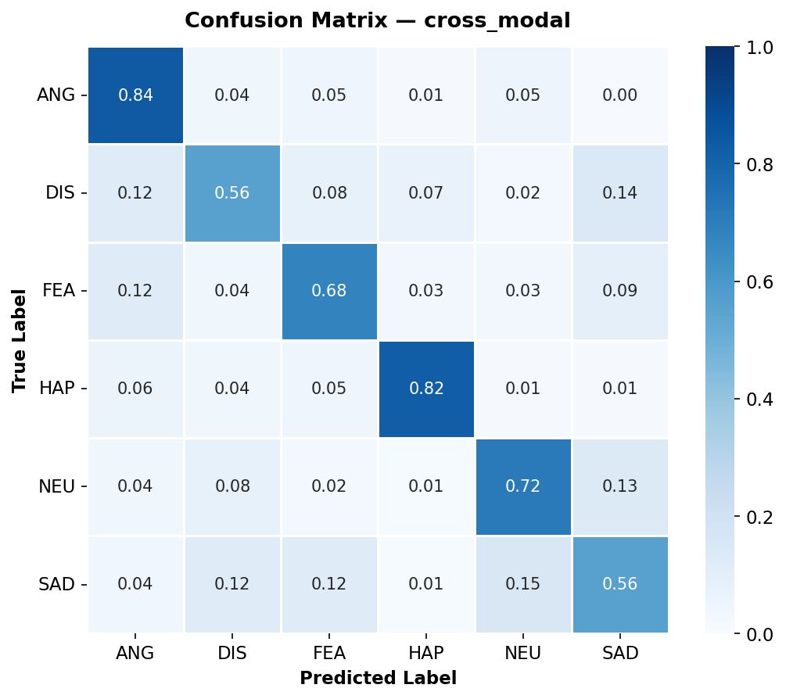
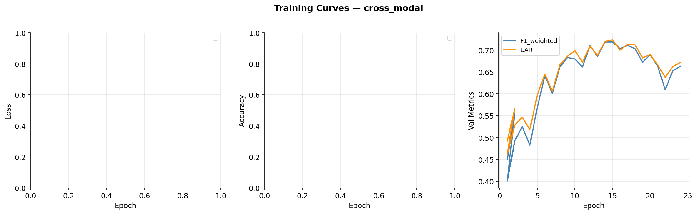

# Multimodal Emotion Recognition

**End-to-end deep learning system that recognizes human emotions from synchronized speech audio and facial video.**

The project trains and compares five models — three fusion strategies and two unimodal baselines — on the CREMA-D dataset, and quantifies the performance gain from multimodal fusion over single-modality systems. All preprocessing, training, evaluation, and visualization steps are automated and reproducible from a single config file.

**Emotions recognized:** Angry · Disgust · Fear · Happy · Neutral · Sad

## Highlights

- Actor-based train/val/test splits across 91 speakers — zero data leakage between sets.
- Visual branch: EfficientNet-B3 backbone with a 4-layer Temporal Transformer over 15 face crops per clip.
- Audio branch: HuBERT-base with mean+std pooling over the token sequence.
- Three fusion strategies compared head-to-head: early (concatenation), late (weighted logits), and cross-modal (bidirectional cross-attention).
- Feature pre-caching reduces training time for all five experiments to ~30 minutes — a 50× speedup over on-the-fly backbone inference.
- Full evaluation suite: UAR, F1-Weighted, confusion matrices, ROC curves, t-SNE embeddings, and training curves.

## Pipeline



A full run from raw video to final results takes approximately **1.5–2 hours** on an RTX 3060-class GPU (~45 min preprocessing, ~20 min feature caching, ~30 min training all five experiments, ~15 min evaluation). CPU-only is possible but HuBERT inference will be significantly slower.

## Quick Start

```bash
conda create -n multimodal_emotion python=3.12
conda activate multimodal_emotion
conda install pytorch torchvision torchaudio pytorch-cuda=11.8 -c pytorch -c nvidia
pip install transformers timm mediapipe opencv-python librosa soundfile \
    imageio-ffmpeg ffmpeg-python numpy pandas scikit-learn matplotlib \
    seaborn tensorboard tqdm PyYAML Pillow sounddevice

# Step 1 — download and preprocess CREMA-D
python scripts/01_prepare_data.py

# Step 2 — pre-extract backbone features (run once)
python scripts/00_cache_features.py

# Step 3 — train all five experiments
python scripts/02_train.py --experiment all

# Step 4 — evaluate on test set and generate all plots
python scripts/03_evaluate.py

# Step 5 — visual demo
python scripts/04_demo.py --mode dataset --n-samples 18 --run cross_modal
```

To train a single model or run inference on a video file:

```bash
python scripts/02_train.py --experiment cross_modal
python scripts/04_demo.py --mode file --input path/to/video.mp4 --run cross_modal
tensorboard --logdir logs/
```

## Key Results

### Test Set Performance (CREMA-D, 1,229 clips, 15 unseen actors)

| Model | Accuracy | UAR | F1-Weighted | F1-Macro |
|---|:-:|:-:|:-:|:-:|
| **Cross-Modal Fusion** ★ | **69.49%** | **0.6954** | **0.6923** | **0.6926** |
| Late Fusion | 67.78% | 0.6776 | 0.6790 | 0.6786 |
| Early Fusion | 65.66% | 0.6557 | 0.6537 | 0.6536 |
| Audio-Only | 62.33% | 0.6253 | 0.6179 | 0.6201 |
| Visual-Only | 47.52% | 0.4779 | 0.4763 | 0.4755 |
| Random Baseline | 16.7% | 0.1667 | — | — |

> **UAR** (Unweighted Average Recall) is the standard metric in Speech Emotion Recognition literature — it weights all classes equally regardless of support size.



### Multimodal Gain Over Unimodal Baselines

| Comparison | F1-W Gain | UAR Gain |
|---|:-:|:-:|
| Cross-Modal vs Audio-Only | +7.4% | +7.0% |
| Cross-Modal vs Visual-Only | +21.6% | +21.8% |
| Cross-Modal vs Random | +52.2% | — |

### Per-Class F1 — Cross-Modal Fusion

| ANG | DIS | FEA | HAP | NEU | SAD |
|:-:|:-:|:-:|:-:|:-:|:-:|
| 0.759 | 0.595 | 0.681 | 0.840 | 0.701 | 0.579 |

Happy and Angry are easiest to recognize. Disgust and Sad are most confused — both are low-energy and acoustically similar to Neutral.



## Reproducible Experiments

| Experiment | Model | Purpose | Config key |
|---|---|---|---|
| Audio baseline | Audio-Only | HuBERT branch in isolation | `audio_only` |
| Visual baseline | Visual-Only | EfficientNet + Transformer in isolation | `visual_only` |
| Early fusion | Early | Concatenation + MLP | `early` |
| Late fusion | Late | Separate heads + learnable weight | `late` |
| Cross-modal fusion | Cross-Modal ★ | Bidirectional cross-attention | `cross_modal` |

All hyperparameters are controlled via `config.yaml`. Re-running any experiment with the same config produces identical results.

## Architecture

The system processes each CREMA-D clip through two parallel branches whose outputs are combined by a fusion module before classification.

The **visual branch** detects and crops 15 face frames per clip with Haar Cascade, encodes them with EfficientNet-B3 (pretrained on ImageNet), then passes the sequence through a 4-layer Pre-LN Transformer Encoder with a CLS token to produce a 256-dimensional representation. The **audio branch** resamples the WAV to 16 kHz, extracts contextual embeddings with HuBERT-base-ls960, applies mean and standard-deviation pooling over the token sequence, and projects to 256 dimensions.

The **fusion module** combines both representations in one of three ways: early fusion concatenates them before an MLP; late fusion runs separate classification heads and combines logits with a learnable scalar; cross-modal fusion applies bidirectional multi-head attention (audio queries visual, visual queries audio), gates the result, and passes it through an MLP — this is the best-performing strategy.

The **classification head** applies LayerNorm → Linear(512→256) → GELU → Dropout(0.3) → Linear(256→6).

### Design Choices

| Component | Choice | Rationale |
|---|---|---|
| Face detector | Haar Cascade (OpenCV) | Zero-dependency, cross-platform |
| Visual backbone | EfficientNet-B3 | Best accuracy/speed tradeoff; ImageNet pretrained |
| Temporal module | Transformer Encoder (Pre-LN, 4 layers) | Parallelizable; attention weights are visualizable |
| Audio backbone | HuBERT-base-ls960 | Consistently outperforms Wav2Vec2 on SER benchmarks |
| Audio pooling | Mean + Std over token sequence | Captures both central tendency and variance of speech |
| Loss | Label Smoothing CE (α=0.1) | Prevents overconfidence on small dataset |
| Training trick | Feature pre-caching | 50× speedup — extract backbones once, train fusion fast |

## Dataset

**CREMA-D** (Crowd-sourced Emotional Multimodal Actors Dataset)

| Property | Value |
|---|---|
| Total clips | 7,442 |
| Actors | 91 (diverse age, ethnicity, gender) |
| Emotions | 6 (ANG, DIS, FEA, HAP, NEU, SAD) |
| Modalities | Audio (WAV) + Video (FLV) |
| Class balance | ~1,271 per class (NEU: 1,087) |
| Split strategy | Actor-based — zero leakage across splits |

| Set | Clips | Actors |
|---|:-:|:-:|
| Train | 5,147 (69.2%) | 63 |
| Val | 1,066 (14.3%) | 13 |
| Test | 1,229 (16.5%) | 15 |

## Scope

This system evaluates acted, lab-recorded speech-video clips under controlled conditions. In-the-wild emotion recognition, spontaneous speech, occluded faces, non-English speakers, and emotions outside the six CREMA-D categories are not addressed. HuBERT and EfficientNet backbone weights are frozen during fusion training; end-to-end fine-tuning is not explored.

## Tested Hardware Target

- NVIDIA GeForce RTX 3060, 12 GB VRAM
- Python 3.12, PyTorch 2.6, CUDA 11.8
- ~30 minutes training time for all five experiments (cached features)
- ~110M total parameters (HuBERT 90M + EfficientNet-B3 12M + fusion 5M)



## Project Structure

```
multimodal-emotion-recognition/
├── config.yaml                        # all hyperparameters in one place
├── requirements.txt
├── data/
│   ├── raw/CREMAD/                    # downloaded dataset (AudioWAV/ + VideoFlash/)
│   ├── processed/
│   │   ├── audio/                     # 7,442 processed WAVs (16kHz, 6s, mono)
│   │   ├── frames/                    # 7,442 × 15 face-cropped PNGs (224×224)
│   │   └── features/                  # pre-extracted HuBERT + EfficientNet features
│   └── splits/                        # train/val/test.csv (actor-based)
├── src/
│   ├── data/
│   │   ├── download.py                # CREMA-D sparse git clone
│   │   ├── preprocess.py              # frame extraction, face detection, audio processing
│   │   ├── dataset.py                 # PyTorch Dataset + CachedDataset + DataLoaders
│   │   └── augmentation.py            # audio and visual augmentation utilities
│   ├── models/
│   │   ├── visual_branch.py           # EfficientNet-B3 + Temporal Transformer
│   │   ├── audio_branch.py            # HuBERT + mean+std projection
│   │   ├── fusion.py                  # early / late / cross-modal fusion modules
│   │   └── multimodal_model.py        # full assembled model (end-to-end + cached)
│   ├── training/
│   │   ├── trainer.py                 # train loop, val loop, checkpointing, TensorBoard
│   │   └── losses.py                  # label smoothing cross-entropy
│   ├── evaluation/
│   │   ├── metrics.py                 # UAR, F1, accuracy, per-class metrics
│   │   └── visualize.py               # all plots (CM, ROC, t-SNE, comparison charts)
│   └── inference/
│       └── predict.py                 # EmotionPredictor inference engine
├── scripts/
│   ├── 00_cache_features.py           # pre-extract backbone features (run once)
│   ├── 01_prepare_data.py             # download + preprocess + split
│   ├── 02_train.py                    # train one or all experiments
│   ├── 03_evaluate.py                 # test set evaluation + all plots
│   └── 04_demo.py                     # visual demo on test samples or video file
├── checkpoints/                       # best model weights per experiment
├── logs/                              # TensorBoard event files
└── results/
    ├── metrics/
    │   ├── all_models_summary.csv     # full metrics table
    │   └── per_class_f1.csv           # per-emotion F1 per model
    └── plots/
        ├── confusion_matrices/        # 5 normalized confusion matrix heatmaps
        ├── roc/                       # 5 × ROC curves (one-vs-rest, per class)
        ├── training_curves/           # loss + accuracy + F1 curves per experiment
        ├── tsne/                      # t-SNE of audio / visual / fused embeddings
        └── modality_comparison.png    # side-by-side model comparison chart
```

## Findings

**Multimodal fusion consistently outperforms unimodal baselines.** The best fusion model achieves +7.4% F1 over audio-only and +21.6% over visual-only, demonstrating clear complementarity between speech and facial expression features.

**Audio dominates visual on acted speech.** Audio-only (F1=0.618) substantially outperforms visual-only (F1=0.476) on CREMA-D. CREMA-D actors produce highly expressive vocal performances, while facial expressions in 4-second clips can be ambiguous.

**Cross-modal attention is the best fusion strategy.** Bidirectional attention allows each modality to query contextually relevant information from the other, producing richer joint representations than simple concatenation or logit averaging. Late fusion is a close second (+1.3% F1 over early).


**Feature pre-caching makes the project practical.** Running HuBERT and EfficientNet on every training step would take 150+ hours on an RTX 3060. Pre-extracting features once reduces total training time for all five experiments to ~30 minutes — a 50× speedup with no loss in model quality.

**Disgust and Sad are the hardest emotions.** Both are acoustically similar (low-energy, slow speech) and visually subtle, and are frequently confused with each other and with Neutral. This aligns with findings in the SER literature.

## License and Citation

Code in this repository is released under the MIT License. Dataset and model weights retain their original licenses: CREMA-D under [ODC-BY 1.0](https://github.com/CheyneyComputerScience/CREMA-D), HuBERT under [Apache 2.0](https://huggingface.co/facebook/hubert-base-ls960), EfficientNet via [timm](https://github.com/huggingface/pytorch-image-models). If this project supports academic work, cite the CREMA-D, HuBERT, and EfficientNet publications alongside this repository.